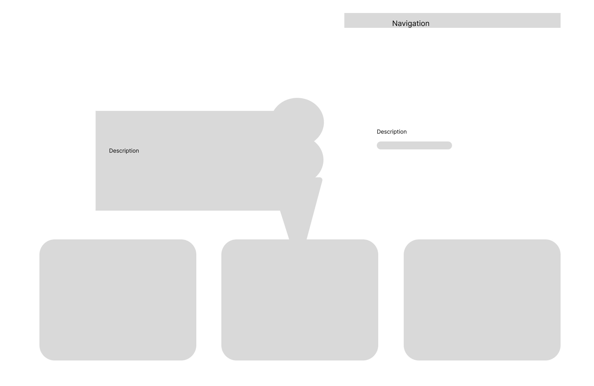
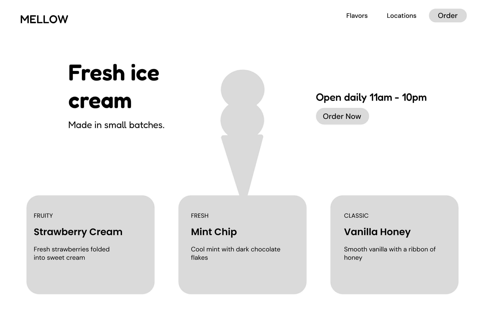
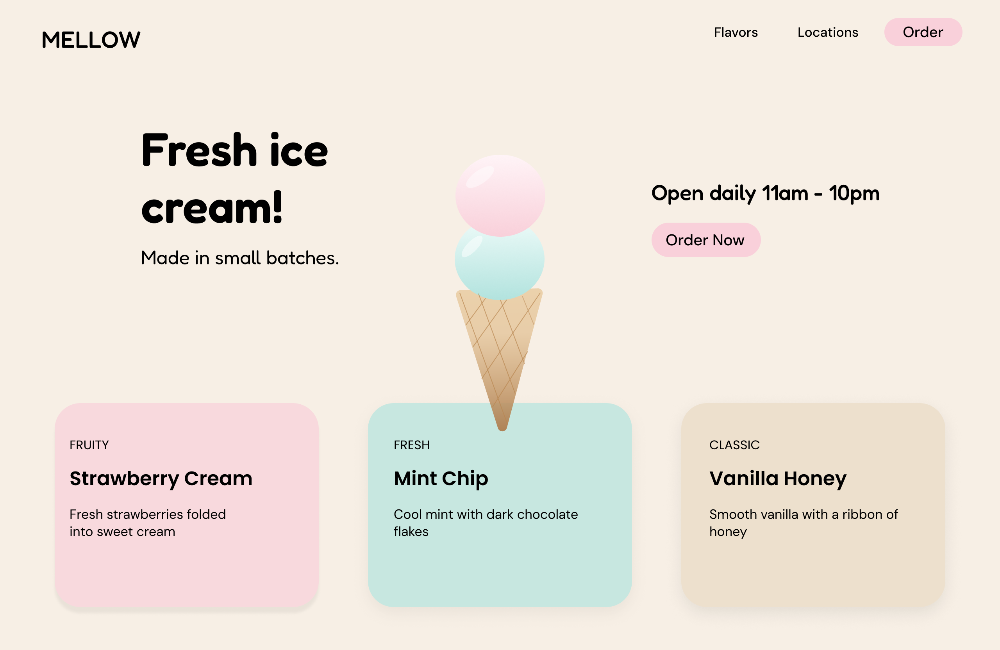

# Design Systems and Wireframing

Full Stack Decal vitamin. Landing page design for an imaginary ice cream shop called **Mellow**.

## Links
- [Figma file]((https://www.figma.com/design/BqyOtMvw1N0hs5V01MDheJ/Fullstack-Decal-Vitamin---Design-Systems---Wireframing--Copy-?node-id=0-1&t=72ehcUBHeu2Zolyo-1)) (public)

## Part 1: Design System

### 1.1 Branding
- Soft, minimal, and friendly
- Users should feel relaxed, and the shop should look modern and easy to use

### 1.2 Color palette
- Light beige `#F7EFE5`: soft, clean background
- Pastel pink `#F9D0DA`: buttons and accents, like strawberry ice cream
- Pastel teal `#C7E7E0`: cards and accents, like mint ice cream
- Beige and pink add warmth, and the teal adds a cool contrast so the page feels playful without being loud

### 1.3 Typography
- Headings: Fredoka (rounded and fun)
- Subheadings: Poppins (clean and minimal)
- Body: DM Sans (easy to read)

## Part 2: Wireframes

### Low-fi
- Layout only: navigation top right, two-scoop cone in the center, description areas on each side, 3 flavor cards below

### Mid-fi
- Added real copy, nav links, buttons, and flavor details

### Hi-fi
- Applied the color palette, fonts, rounded cards with soft shadows, and a shaded ice cream cone illustration

